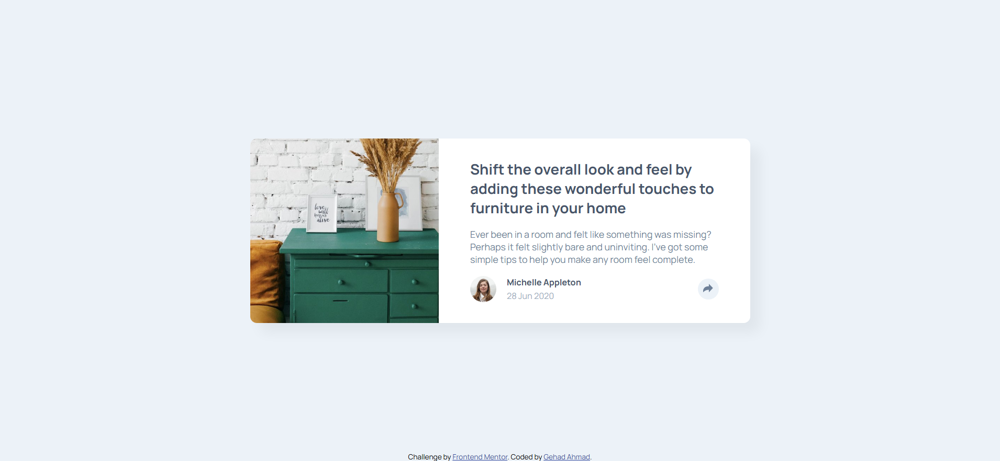
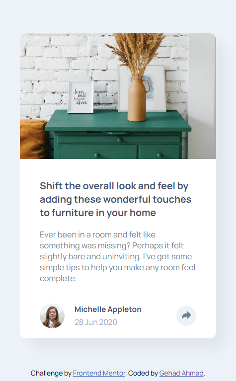

# Frontend Mentor - Article preview component solution

This is a solution to the [Article preview component challenge on Frontend Mentor](https://www.frontendmentor.io/challenges/article-preview-component-dYBN_pYFT). 

## Overview

### Screenshot

#### Desktop View

#### Mobile View

### Links

- Solution URL: [https://github.com/Gehad28/article-preview-component](https://github.com/Gehad28/article-preview-component)
- Live Site URL: [https://gehad28.github.io/article-preview-component](https://gehad28.github.io/article-preview-component)

## My process

### Built with

- Semantic HTML5 markup
- CSS custom properties
- Flexbox
- CSS Grid
- Desktop-first workflow

## Author

- Website - [Gehad Ahmad](https://github.com/Gehad28)
- Frontend Mentor - [@Gehad28](https://www.frontendmentor.io/profile/Gehad28)